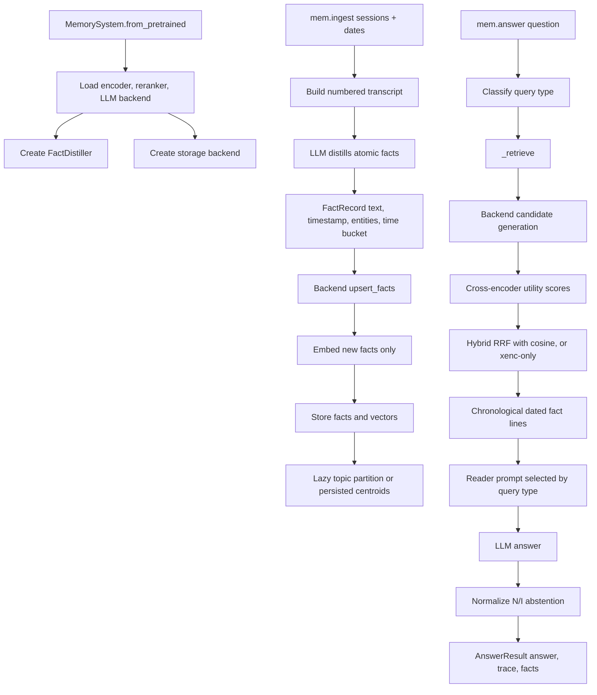
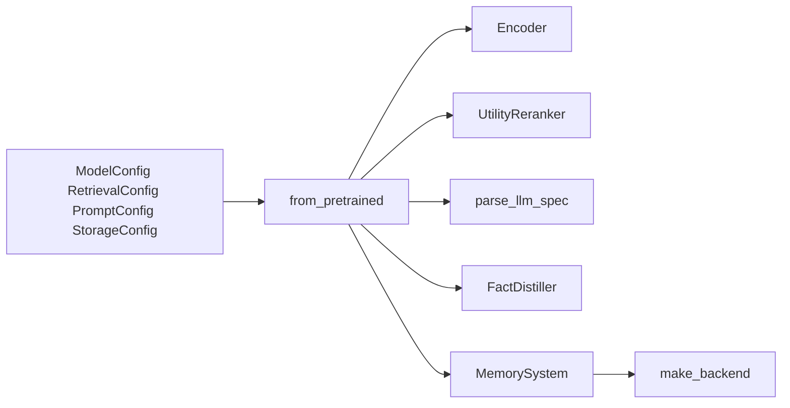
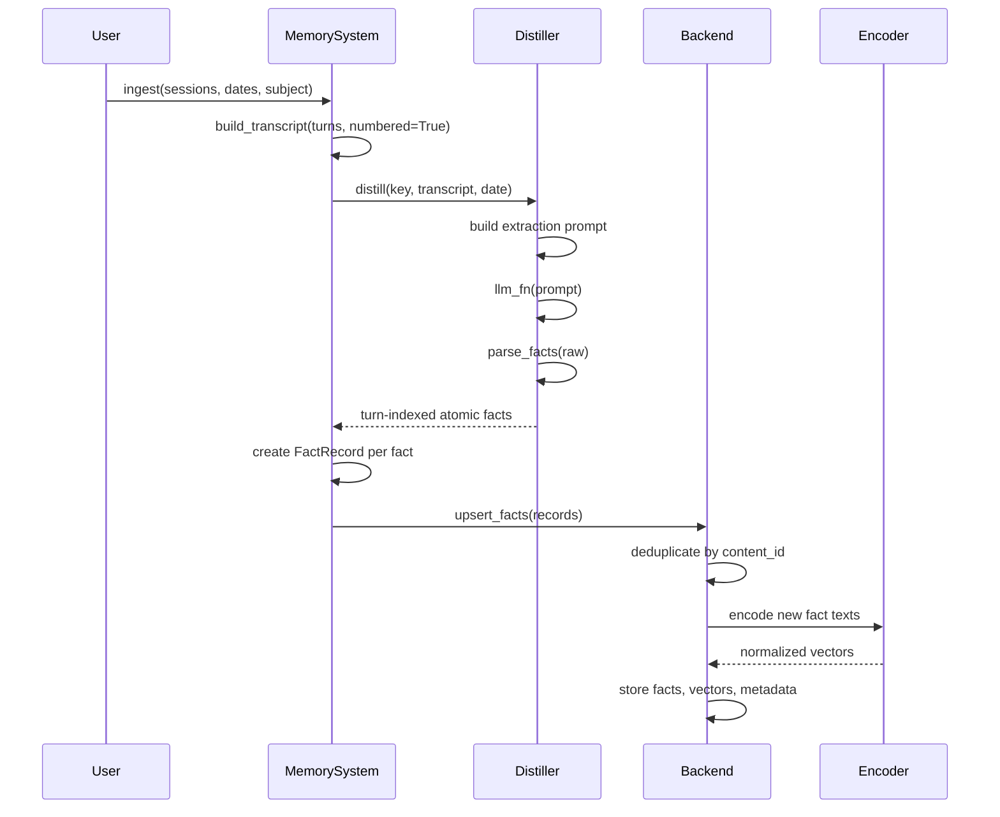
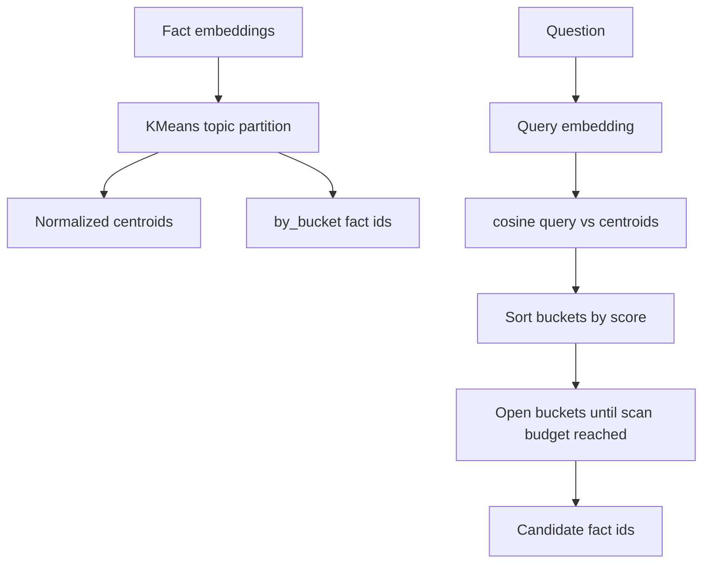
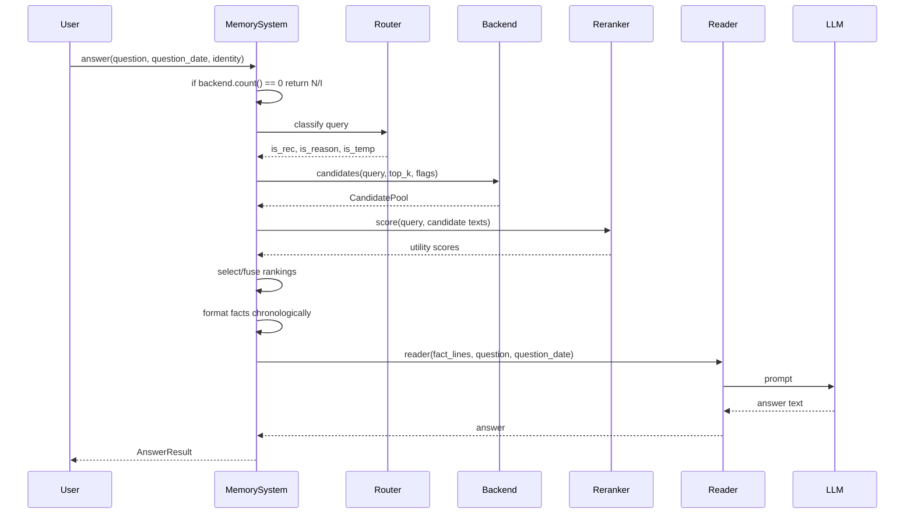
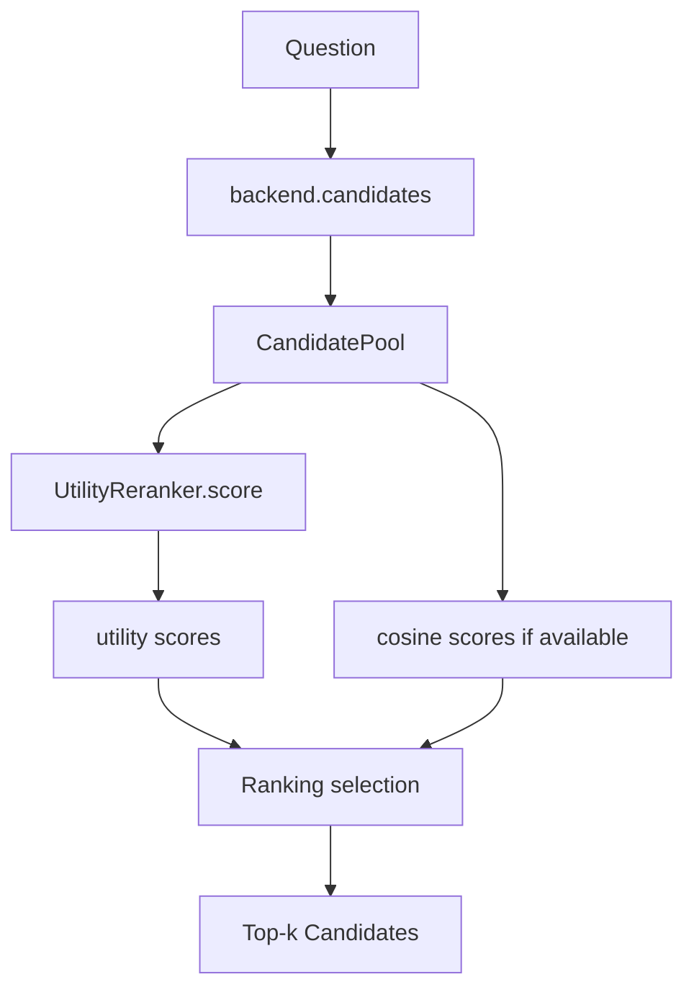
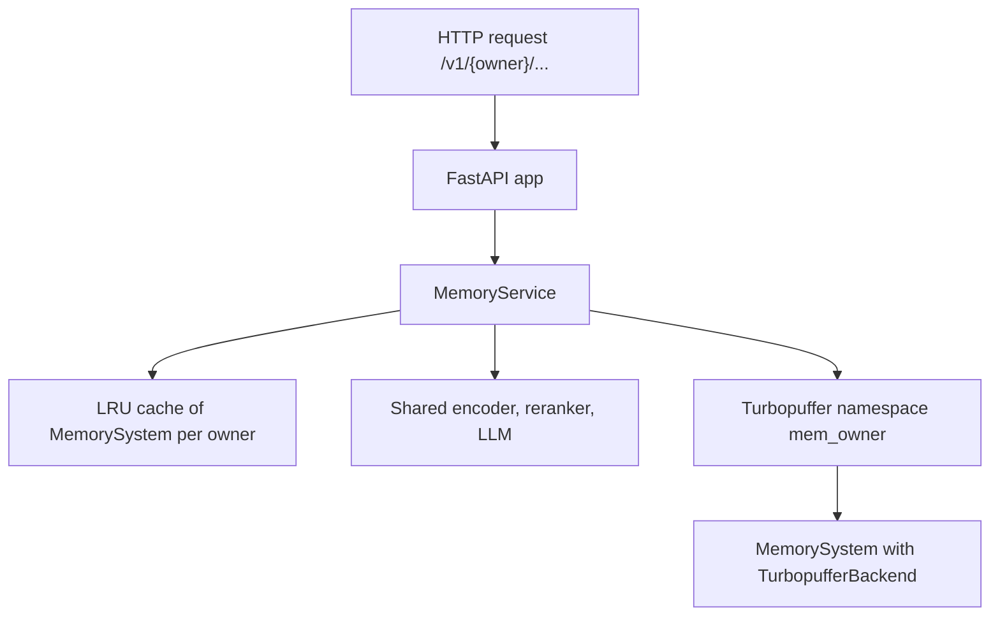
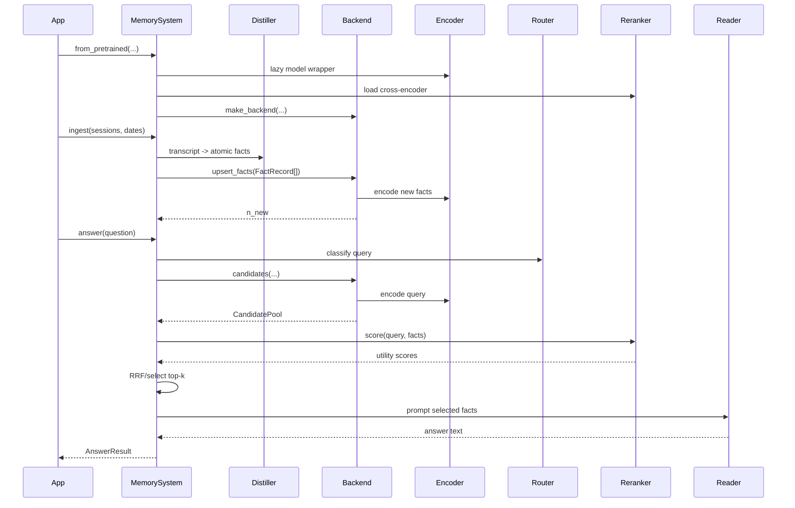

# MEMBUKKIT Code Walkthrough

This document explains the main code paths in MEMBUKKIT: initialization,
ingestion, storage, retrieval, query routing, answer generation, service APIs,
CLI evaluation, and the supporting model/prompt layers. Public timestamp
inputs accept `datetime` objects or ISO8601 strings; legacy slash-date strings
remain supported for benchmarks and older callers.

The central object is
[`MemorySystem`](https://github.com/memseekai/membukkit/blob/main/src/membukkit/pipeline.py). Most application code either
constructs a `MemorySystem`, ingests conversation sessions into it, or asks it
questions.

## One-Page Schematic



## Public API

The package exports its main user-facing types in
[`src/membukkit/__init__.py`](https://github.com/memseekai/membukkit/blob/main/src/membukkit/__init__.py):

| Name | Purpose |
|---|---|
| `MemorySystem` | Main stateful memory pipeline. |
| `ModelConfig` | Tells the system where encoder and reranker weights live. |
| `RetrievalConfig` | Controls bucket count, scan budgets, top-k, fusion, and service retrieval mode. |
| `PromptConfig` | Optional prompt overrides. |
| `StorageConfig` | Chooses in-memory or Turbopuffer storage. |
| `AnswerResult` | Return object from `mem.answer(...)`. |
| `RetrievalTrace` | Inspectable retrieval trace attached to an answer. |

Typical usage:

```python
from membukkit import MemorySystem, ModelConfig, RetrievalConfig, PromptConfig

mem = MemorySystem.from_pretrained(
    models=ModelConfig(model_dir="./models"),
    retrieval=RetrievalConfig(),
    llm="openai:gpt-4o-mini",
    prompts=PromptConfig.default(),
)

mem.ingest(
    sessions=[[{"role": "user", "content": "I switched to a vegan diet."}]],
    dates=["2024-06-01"],
)

res = mem.answer("What diet am I on?", question_date="2024-07-01")
print(res.answer)
print(res.facts)
print(res.trace)
```

## Directory Map

| Path | Role |
|---|---|
| [`pipeline.py`](https://github.com/memseekai/membukkit/blob/main/src/membukkit/pipeline.py) | Main `MemorySystem` pipeline. |
| [`config.py`](https://github.com/memseekai/membukkit/blob/main/src/membukkit/config.py) | Dataclass configuration. |
| [`extraction/`](https://github.com/memseekai/membukkit/blob/main/src/membukkit/extraction) | Session-to-atomic-fact distillation. |
| [`prompts/`](https://github.com/memseekai/membukkit/blob/main/src/membukkit/prompts) | Prompt templates for extraction, reading, and eval protocols. |
| [`models/`](https://github.com/memseekai/membukkit/blob/main/src/membukkit/models) | Encoder and cross-encoder reranker wrappers. |
| [`retrieval/`](https://github.com/memseekai/membukkit/blob/main/src/membukkit/retrieval) | Bucket construction, routing, query classification, filters. |
| [`storage/`](https://github.com/memseekai/membukkit/blob/main/src/membukkit/storage) | Backend abstraction, in-memory backend, Turbopuffer backend. |
| [`reading/`](https://github.com/memseekai/membukkit/blob/main/src/membukkit/reading) | Reader factories that turn facts into answer prompts. |
| [`llm/`](https://github.com/memseekai/membukkit/blob/main/src/membukkit/llm) | OpenAI, Anthropic, and local LLM adapters. |
| [`service/`](https://github.com/memseekai/membukkit/blob/main/src/membukkit/service) | FastAPI multi-tenant service. |
| [`data/`](https://github.com/memseekai/membukkit/blob/main/src/membukkit/data) | LongMemEval and LoCoMo dataset adapters. |
| [`eval/`](https://github.com/memseekai/membukkit/blob/main/src/membukkit/eval) | Evaluation harness and judge prompts. |
| [`cli.py`](https://github.com/memseekai/membukkit/blob/main/src/membukkit/cli.py) | `membukkit eval`, training dispatchers, and `membukkit serve`. |
| [`telemetry.py`](https://github.com/memseekai/membukkit/blob/main/src/membukkit/telemetry.py) | Optional Logfire/OpenTelemetry facade. |

## Initialization

Initialization usually starts at
[`MemorySystem.from_pretrained`](https://github.com/memseekai/membukkit/blob/main/src/membukkit/pipeline.py).



`from_pretrained` does five things:

1. Resolves model paths through
   [`models/registry.py`](https://github.com/memseekai/membukkit/blob/main/src/membukkit/models/registry.py).
2. Creates an [`Encoder`](https://github.com/memseekai/membukkit/blob/main/src/membukkit/models/encoder.py), a lazy wrapper
   around `SentenceTransformer`.
3. Loads a [`UtilityReranker`](https://github.com/memseekai/membukkit/blob/main/src/membukkit/models/reranker.py), a
   `CrossEncoder` that scores `(query, fact)` pairs.
4. Parses the LLM spec through
   [`llm/backends.py`](https://github.com/memseekai/membukkit/blob/main/src/membukkit/llm/backends.py), for example
   `openai:gpt-4o-mini`.
5. Creates a [`FactDistiller`](https://github.com/memseekai/membukkit/blob/main/src/membukkit/extraction/distiller.py) and a
   storage backend.

The backend is created by
[`storage.make_backend`](https://github.com/memseekai/membukkit/blob/main/src/membukkit/storage/__init__.py):

- `StorageConfig.backend="memory"` gives
  [`InMemoryBackend`](https://github.com/memseekai/membukkit/blob/main/src/membukkit/storage/memory.py).
- `StorageConfig.backend="turbopuffer"` gives
  [`TurbopufferBackend`](https://github.com/memseekai/membukkit/blob/main/src/membukkit/storage/turbopuffer.py).

## Configuration

[`config.py`](https://github.com/memseekai/membukkit/blob/main/src/membukkit/config.py) defines four important dataclasses.

`ModelConfig`

- `model_dir`: optional root for model weights.
- `encoder`: encoder path or name.
- `reranker`: reranker path or name.
- `device`: optional device override.

`RetrievalConfig`

- `num_buckets`: number of topic buckets to build.
- `scan_budget`: fraction of memory to scan for normal topic routing.
- `scan_budget_reason`: larger scan budget for reasoning queries.
- `scan_budget_temporal`: optional override for temporal questions.
- `bucket_mode`: `topic`, `multiaxis`, or fallback non-bucket retrieval.
- `select`: `hybrid`, `cosine`, or xenc-style reranking.
- `top_k`: default final facts for the reader.
- `reasoning_top_k`: larger final fact count for reasoning questions.
- `retrieval_mode`: service mode, `gated` or `open`.
- `bm25_lane`: whether Turbopuffer adds a lexical BM25 lane.

`StorageConfig`

- Chooses memory vs Turbopuffer.
- Provides Turbopuffer namespace, region, API key, vector precision, and
  recluster threshold.

`PromptConfig`

- Holds optional custom prompt templates.
- Current pipeline code mostly uses built-in prompt constants directly.

## Ingestion Flow

Ingestion is handled by
[`MemorySystem.ingest`](https://github.com/memseekai/membukkit/blob/main/src/membukkit/pipeline.py).



### Input Shape

`ingest` receives:

```python
sessions: List[List[Dict[str, str]]]
dates: Optional[List[str]]
subject: Optional[str]
```

Each session is a list of turns:

```python
{"role": "user", "content": "I started learning Portuguese."}
```

The date list is parallel to sessions. Dates are normalized through
`membukkit.time_utils.parse_datetime`, which accepts Python `datetime`/`date`
objects, ISO8601 strings, and legacy slash-date strings:

- `YYYY-MM-DD`
- `YYYY-MM-DDTHH:MM:SS`
- `YYYY-MM-DDTHH:MM:SSZ`
- `YYYY-MM-DDTHH:MM:SS-05:00`
- `YYYY/MM/DD HH:MM`
- `YYYY/MM/DD`

### Transcript Building

[`build_transcript`](https://github.com/memseekai/membukkit/blob/main/src/membukkit/extraction/distiller.py) turns a session
into compact numbered lines:

```text
[T0] user: I started learning Portuguese.
[T1] assistant: Nice, here is a study plan...
```

Long turn text is truncated to keep distillation prompts bounded.

### Fact Distillation

[`FactDistiller`](https://github.com/memseekai/membukkit/blob/main/src/membukkit/extraction/distiller.py) converts a transcript
into atomic facts. It uses prompt templates in
[`prompts/extraction.py`](https://github.com/memseekai/membukkit/blob/main/src/membukkit/prompts/extraction.py).

There are two prompt modes:

| Prompt | Used when | Behavior |
|---|---|---|
| `EXTRACTION_PROMPT` | No subject supplied | Writes facts about "the user". |
| `NAMED_EXTRACTION_PROMPT` | `subject` supplied | Writes facts about the named person and protects identity attribution. |

The prompt requires output lines in this format:

```text
<turn_index> | <atomic fact>
```

`parse_facts` reads those lines into `(turn_index, fact)` pairs. Empty or
`NONE` output means no facts were extracted.

Distillation can be cached by content hash if `FactDistiller(cache_path=...)`
is used. The cache key includes a prompt version, and for named extraction it
also includes the subject.

### FactRecord Creation

For each distilled fact, `MemorySystem.ingest` creates a
[`FactRecord`](https://github.com/memseekai/membukkit/blob/main/src/membukkit/storage/base.py) with:

- `text`: the atomic fact.
- `timestamp`: parsed session date.
- `source_session`: currently `ingest:<session_index>`.
- `subject`: optional memory owner/person.
- `entities`: simple extracted entity strings.
- `time_bucket`: `YYYY-MM` or `unknown`.

Entity extraction and time bucketing come from
[`retrieval/bucket_index.py`](https://github.com/memseekai/membukkit/blob/main/src/membukkit/retrieval/bucket_index.py).

## Storage Backends

Storage is hidden behind the
[`MemoryBackend`](https://github.com/memseekai/membukkit/blob/main/src/membukkit/storage/base.py) protocol. The pipeline does
not directly own arrays or database rows anymore. It asks the backend to:

- clear memory,
- upsert facts,
- count facts,
- generate candidate pools,
- expose topic partitions,
- provide topic exemplars,
- delete memory.

The key shared data structures are:

| Type | Meaning |
|---|---|
| `FactRecord` | A fact before or during storage. |
| `Candidate` | A fact returned from retrieval, ready for reranking. |
| `CandidatePool` | Candidate list plus trace and cosine availability. |
| `MemoryBackend` | Protocol implemented by storage backends. |

Internally, timestamps are represented as `datetime` objects. ISO8601 is the
canonical string format for structured fields, while reader prompts keep compact
date-only prefixes such as `[2024-06-01]`.

### Deduplication

[`content_id`](https://github.com/memseekai/membukkit/blob/main/src/membukkit/storage/base.py) creates a stable SHA-1 based id
from normalized fact text and optional subject. Backends deduplicate on that id,
so ingesting the same extracted fact twice does not store it twice.

### InMemoryBackend

[`InMemoryBackend`](https://github.com/memseekai/membukkit/blob/main/src/membukkit/storage/memory.py) is the default backend.
It keeps:

- `_texts`
- `_times`
- `_entities`
- `_time_buckets`
- `_ids`
- `_embs`
- `_partition`

On `upsert_facts`, it:

1. Deduplicates incoming facts.
2. Embeds only new fact texts.
3. Appends text, timestamp, metadata, ids, and vectors.
4. Invalidates the topic partition so it will rebuild lazily.

This backend is used by tests, local Python usage, and evaluation.

### TurbopufferBackend

[`TurbopufferBackend`](https://github.com/memseekai/membukkit/blob/main/src/membukkit/storage/turbopuffer.py) is the persistent
service backend. Each owner maps to one namespace, usually `mem_<owner>`.

It stores:

- vector,
- fact text,
- timestamp,
- topic bucket,
- entities,
- time bucket,
- source metadata,
- subject,
- supersession fields,
- partition version.

Important behavior:

- New facts are embedded before write.
- Vectors are stored as `f16` by default.
- Existing ids are checked before embedding to avoid unnecessary model calls.
- Topic centroids are stored as a sentinel `__partition__` row.
- `maybe_recluster` and `recluster` rebuild centroids and patch scalar
  `topic_bucket` values without rewriting vectors.
- `supersede` can mark older facts as stale by patching metadata.

## Topic Buckets And Routing

The core retrieval method lives in
[`retrieval/buckets.py`](https://github.com/memseekai/membukkit/blob/main/src/membukkit/retrieval/buckets.py).



### Building A Topic Partition

`build_topic_partition(fact_embs, k=24)`:

1. Chooses an effective bucket count.
2. Runs KMeans or MiniBatchKMeans.
3. Builds `by_bucket`, mapping each bucket to member fact indices.
4. Computes normalized centroids.
5. Optionally builds multiple prototypes per bucket with `k_proto`.

For very small banks, all facts go into one bucket.

### Routing A Query

`route_topic(partition, query_emb, budget=0.3)`:

1. Normalizes the query embedding.
2. Scores every bucket centroid.
3. Converts scores to softmax route probabilities.
4. Opens buckets in descending score order.
5. Stops when opened facts cover at least the scan budget.
6. Returns candidate indices and an inspectable trace.

The trace includes:

- opened bucket ids,
- route probabilities,
- bucket sizes,
- total facts,
- scanned facts,
- scan fraction,
- total buckets.

### Multi-Axis Routing

`bucket_mode="multiaxis"` adds two symbolic axes:

- entity buckets from simple entity extraction,
- time buckets from year-month timestamps.

`route_multiaxis` unions:

- topic-routed candidates,
- exact entity matches,
- explicit time-bucket matches for temporal questions.

This is useful for catching named or dated evidence that topic routing alone
may miss.

## Query Classification

Query classification lives in
[`retrieval/router.py`](https://github.com/memseekai/membukkit/blob/main/src/membukkit/retrieval/router.py).

The router is deliberately rule-based. It detects:

| Query class | Examples of cues | Reader behavior |
|---|---|---|
| `TEMPORAL` | "when", "before", "after", "latest", dates | Use reasoning reader and temporal retrieval. |
| `KNOWLEDGE_UPDATE` | "now", "currently", "changed", "switched" | Use reasoning reader to resolve current/latest facts. |
| `AGGREGATION` | "how many", "list all", "every", "total" | Use reasoning reader for multi-fact synthesis. |
| `GENERAL` | No special cues | Use dated reader. |

Recommendation detection is separate:

```python
is_recommendation_query(query_text)
```

If a query is a recommendation/advice request, it routes to the recommendation
reader first, even if it also has other cues.

The helper functions used by the pipeline are:

- `is_recommendation_query`
- `is_reasoning_query`
- `is_temporal_query`

## Answer Flow

Answering is handled by
[`MemorySystem.answer`](https://github.com/memseekai/membukkit/blob/main/src/membukkit/pipeline.py).



The answer path has four main stages:

1. Classify the query.
2. Retrieve and rerank candidate facts.
3. Select the right reader.
4. Return an `AnswerResult`.

### Top-K Adjustment

Normal questions use `RetrievalConfig.top_k`.

Reasoning questions can use the larger `RetrievalConfig.reasoning_top_k`:

```python
if self._retrieval.reasoning_top_k > k_eff and is_reason:
    k_eff = self._retrieval.reasoning_top_k
```

This gives multi-fact questions more evidence.

## Candidate Generation And Reranking

Candidate generation happens inside the backend. Reranking happens in
`MemorySystem._retrieve`.



### In-Memory Candidate Generation

For `bucket_mode="topic"`:

1. Encode query.
2. Build or reuse topic partition.
3. Route query to buckets by scan budget.
4. Return candidates from opened buckets.
5. If `select="hybrid"`, attach cosine scores for RRF fusion.

For `bucket_mode="multiaxis"`:

1. Build topic/entity/time partition.
2. Route by topic.
3. Add entity and time matches.
4. Optionally cap topic candidates by cosine before reranking.

For other bucket modes:

1. Compute cosine against all facts.
2. Take the top `candidate_pool`.

### Turbopuffer Candidate Generation

The Turbopuffer backend performs a database-backed candidate search:

1. Count live facts.
2. Embed the query.
3. Extract query entities and optional time ranges.
4. Route against cached topic centroids.
5. Build a Turbopuffer filter.
6. Run vector ANN and optionally BM25.
7. Fuse server-side with RRF when both lanes are enabled.
8. Return candidates to the local cross-encoder.

There are two service retrieval modes:

| Mode | Meaning |
|---|---|
| `gated` | Topic/entity/time filters constrain or broaden retrieval before DB search. |
| `open` | ANN-first over the namespace; buckets become descriptive trace data. |

### Local Cross-Encoder Rerank

[`UtilityReranker.score`](https://github.com/memseekai/membukkit/blob/main/src/membukkit/models/reranker.py) scores every
candidate as a `(query, fact)` pair. Higher means more useful/relevant.

### Hybrid RRF Fusion

When `RetrievalConfig.select == "hybrid"` and cosine scores exist, the pipeline
uses `rrf_order` from
[`retrieval/buckets.py`](https://github.com/memseekai/membukkit/blob/main/src/membukkit/retrieval/buckets.py).

RRF combines two rankings over the same candidate pool:

- cross-encoder utility rank,
- cosine similarity rank.

The formula is:

```text
score = 1 / (k_rrf + rank_cross_encoder) + 1 / (k_rrf + rank_cosine)
```

The intuition: a fact can rank well if either the semantic vector signal or the
cross-encoder relevance signal strongly likes it.

## Fact Presentation

After retrieval, `_present_temporal` formats selected candidates as dated facts
and sorts them chronologically:

```text
[2024-06-01] The user switched to a vegan diet.
[2024-06-10] The user said the vegan diet was going well.
```

Readers see this ordered list, not raw `Candidate` objects.

## Reader Layer

Readers live in
[`reading/readers.py`](https://github.com/memseekai/membukkit/blob/main/src/membukkit/reading/readers.py), with prompts in
[`prompts/reading.py`](https://github.com/memseekai/membukkit/blob/main/src/membukkit/prompts/reading.py).

The pipeline chooses one of three main readers:

| Reader factory | Prompt | Used for |
|---|---|---|
| `make_dated_reader` | `DATED_READER_PROMPT` | Direct memory lookups. |
| `make_reasoning_reader` | `REASONING_READER_PROMPT` | Temporal, counting, latest/current, multi-session synthesis. |
| `make_recommendation_reader` | `RECOMMENDATION_READER_PROMPT` | Personalized advice or recommendations. |

All reader factories close over an `llm_fn` and return an `answer` function:

```python
answer(fact_lines: List[str], question: str, qdate: str) -> str
```

Each reader:

1. Builds a `fact_block`.
2. Adds `today_line` if a question date exists.
3. Adds `_identity_preamble(identity)` if identity exists.
4. Formats a prompt.
5. Calls the LLM.
6. Returns stripped answer text.

The reasoning and Mem0 readers also strip final-answer markers such as
`Answer:` or `ANSWER:`.

### Abstention

The canonical internal abstention is:

```text
N/I
```

`_normalize_abstain` converts `N/I` or `NI` to:

```text
Based on our past conversations, you never mentioned that, so I don't have any information about it.
```

`make_abstain_gate` can build a groundedness verifier, but the main pipeline
currently does not call it.

## LLM Backends

[`llm/backends.py`](https://github.com/memseekai/membukkit/blob/main/src/membukkit/llm/backends.py) defines a simple callable
interface:

```python
class LLMBackend(Protocol):
    def __call__(self, prompt: str) -> str: ...
```

Implemented backends:

| Backend | Spec example | Notes |
|---|---|---|
| OpenAI | `openai:gpt-4o-mini` | Uses chat completions. Temperature is omitted for models that do not support it. |
| Anthropic | `anthropic:claude-sonnet-4-20250514` | Uses messages API. |
| Local OpenAI-compatible | `local:http://localhost:8000/v1:model-name` | Useful for local model servers. |

The same `llm_fn` is used for extraction and reading unless you manually wire
different functions.

## Models

There are two learned model roles.

### Encoder

[`Encoder`](https://github.com/memseekai/membukkit/blob/main/src/membukkit/models/encoder.py) lazily loads a
`SentenceTransformer` and encodes fact text and query text into normalized
vectors. These vectors power:

- fact storage,
- KMeans topic buckets,
- query-to-centroid routing,
- cosine ranking.

### Reranker

[`UtilityReranker`](https://github.com/memseekai/membukkit/blob/main/src/membukkit/models/reranker.py) wraps a
`CrossEncoder`. It scores `(query, fact)` pairs after candidate generation.

This model is more expensive than cosine, so bucket routing keeps its input
pool small.

## Service API

The service is implemented in
[`service/app.py`](https://github.com/memseekai/membukkit/blob/main/src/membukkit/service/app.py) and
[`service/manager.py`](https://github.com/memseekai/membukkit/blob/main/src/membukkit/service/manager.py).



`MemoryService` loads expensive models once per worker. Each owner gets a
lightweight `MemorySystem` bound to one Turbopuffer namespace.

Important endpoints:

| Endpoint | Purpose |
|---|---|
| `GET /health` | Health check. |
| `POST /v1/{owner}/ingest` | Ingest sessions into an owner's memory. |
| `POST /v1/{owner}/answer` | Answer from an owner's memory. |
| `GET /v1/{owner}/partition` | Show partition version and bucket sizes. |
| `POST /v1/{owner}/label_buckets` | Ask the LLM to label buckets. |
| `POST /v1/{owner}/warm` | Warm namespace and centroid cache. |
| `POST /v1/{owner}/recluster` | Rebuild topic partition if needed. |
| `DELETE /v1/{owner}` | Delete an owner's namespace. |

Owner ids are sanitized by `namespace_for(owner)` into `mem_<owner>`.

## CLI

[`cli.py`](https://github.com/memseekai/membukkit/blob/main/src/membukkit/cli.py) defines the `membukkit` command.

Main subcommands:

| Command | Purpose |
|---|---|
| `membukkit eval` | Run LongMemEval or LoCoMo evaluation. |
| `membukkit train-encoder` | Dispatch to `scripts/train_encoder.py`. |
| `membukkit train-reranker` | Dispatch to `scripts/train_reranker.py`. |
| `membukkit serve` | Start the FastAPI service with Turbopuffer storage. |

### CLI Evaluation Path

The CLI eval path drives the **production** `MemorySystem`, the same ingest +
kind-scoped union retrieval the service uses, so eval can't diverge from
production (the old bespoke in-CLI retrieval has been removed):

1. Load dataset instances.
2. Build retrieval tasks with `_build_all_tasks_lib`: ingest each conversation
   into a `MemorySystem` (in-memory or Turbopuffer backend) and collect the
   union fact lines per method via `answer(..., generate_answer=False)`.
3. Cache task rows to the persistent task cache.
4. Run readers and judges concurrently.
5. Write `e2e_summary.json` and `e2e_results.jsonl`.

`--replay-tasks` skips model loading and retrieval by reusing the cached task
rows.

## Data And Evaluation

Dataset interfaces live in [`data/base.py`](https://github.com/memseekai/membukkit/blob/main/src/membukkit/data/base.py):

- `FactInput`
- `QueryInput`
- `CoreMemDataset`

LongMemEval support:

- [`data/longmemeval.py`](https://github.com/memseekai/membukkit/blob/main/src/membukkit/data/longmemeval.py) downloads the
  cleaned benchmark from Hugging Face.
- [`data/instance.py`](https://github.com/memseekai/membukkit/blob/main/src/membukkit/data/instance.py) adapts each item into
  facts, queries, abilities, evidence indices, and utility matrices.

LoCoMo support:

- [`data/locomo.py`](https://github.com/memseekai/membukkit/blob/main/src/membukkit/data/locomo.py) adapts LoCoMo into the
  LongMemEval-style instance interface.
- LoCoMo categories are mapped into broad task types for reader and judge use.

Judging:

- [`eval/judges.py`](https://github.com/memseekai/membukkit/blob/main/src/membukkit/eval/judges.py) has a generic numeric LLM
  judge and an official LongMemEval yes/no judge.
- [`prompts/protocol.py`](https://github.com/memseekai/membukkit/blob/main/src/membukkit/prompts/protocol.py) contains Mem0
  answer and judge prompts.
- [`eval/harness.py`](https://github.com/memseekai/membukkit/blob/main/src/membukkit/eval/harness.py) provides a high-level
  `evaluate(mem, dataset, ...)` wrapper that resets and ingests per instance.

## Telemetry

[`telemetry.py`](https://github.com/memseekai/membukkit/blob/main/src/membukkit/telemetry.py) is a dependency-optional facade
over Logfire/OpenTelemetry.

The rest of the code can call:

- `telemetry.span(...)`
- `telemetry.timed(...)`
- `telemetry.counter(...)`
- `telemetry.histogram(...)`
- `telemetry.set_attributes(...)`

If Logfire is not installed or configured, these calls become safe no-ops.

By default, raw user text is not attached to telemetry. `capture_content=True`
must be explicitly enabled to attach question, answer, or memory text.

## Runtime Sequence: Ingest Then Answer



## Important Design Choices

### Atomic Facts Instead Of Raw Turns

The distiller rewrites chat sessions into short, self-contained memory facts.
This makes retrieval units cleaner and makes the answer more likely to be
explicit in the facts handed to the reader.

### Buckets As Both Index And Explanation

Topic buckets are not only for speed. The opened bucket list is the retrieval
explanation: it says which regions of memory were activated and how much memory
was scanned.

### Cross-Encoder Only After Gating

The cross-encoder is powerful but expensive. MEMBUKKIT first uses embeddings and
bucket routing to produce a smaller candidate pool, then applies the
cross-encoder only inside that pool.

### Query-Type-Routed Readers

One prompt does not fit every question. The router picks:

- dated reader for direct lookup,
- reasoning reader for synthesis,
- recommendation reader for personalized advice.

### Backend Seam

`MemorySystem` owns model logic and final reranking. Backends own fact storage
and candidate materialization. This keeps the in-memory research path and the
Turbopuffer service path under one API.

## Common Modification Points

| Goal | Start here |
|---|---|
| Change how facts are extracted | [`prompts/extraction.py`](https://github.com/memseekai/membukkit/blob/main/src/membukkit/prompts/extraction.py), [`extraction/distiller.py`](https://github.com/memseekai/membukkit/blob/main/src/membukkit/extraction/distiller.py) |
| Change reader behavior | [`prompts/reading.py`](https://github.com/memseekai/membukkit/blob/main/src/membukkit/prompts/reading.py), [`reading/readers.py`](https://github.com/memseekai/membukkit/blob/main/src/membukkit/reading/readers.py) |
| Change query classification | [`retrieval/router.py`](https://github.com/memseekai/membukkit/blob/main/src/membukkit/retrieval/router.py) |
| Change bucket routing | [`retrieval/buckets.py`](https://github.com/memseekai/membukkit/blob/main/src/membukkit/retrieval/buckets.py) |
| Change metadata or storage semantics | [`storage/base.py`](https://github.com/memseekai/membukkit/blob/main/src/membukkit/storage/base.py), backend implementation |
| Change local retrieval behavior | [`storage/memory.py`](https://github.com/memseekai/membukkit/blob/main/src/membukkit/storage/memory.py), `MemorySystem._retrieve` |
| Change service retrieval behavior | [`storage/turbopuffer.py`](https://github.com/memseekai/membukkit/blob/main/src/membukkit/storage/turbopuffer.py), [`retrieval/query_filters.py`](https://github.com/memseekai/membukkit/blob/main/src/membukkit/retrieval/query_filters.py) |
| Change eval scoring | [`eval/judges.py`](https://github.com/memseekai/membukkit/blob/main/src/membukkit/eval/judges.py), [`prompts/protocol.py`](https://github.com/memseekai/membukkit/blob/main/src/membukkit/prompts/protocol.py) |
| Add API endpoint | [`service/app.py`](https://github.com/memseekai/membukkit/blob/main/src/membukkit/service/app.py) |
| Change CLI options | [`cli.py`](https://github.com/memseekai/membukkit/blob/main/src/membukkit/cli.py) |

## Compact Mental Model

```text
Conversation sessions
    -> LLM distillation
    -> atomic dated facts
    -> embeddings + metadata
    -> storage backend
    -> topic/entity/time organization
    -> query routing
    -> candidate pool
    -> cross-encoder rerank
    -> hybrid fusion
    -> dated fact lines
    -> query-type-specific reader prompt
    -> final answer + trace
```

In short: MEMBUKKIT turns messy conversational history into dated atomic facts,
organizes those facts into explainable buckets, scans only the relevant memory
regions for a question, reranks the selected facts, and asks a reader LLM to
answer only from that evidence.
