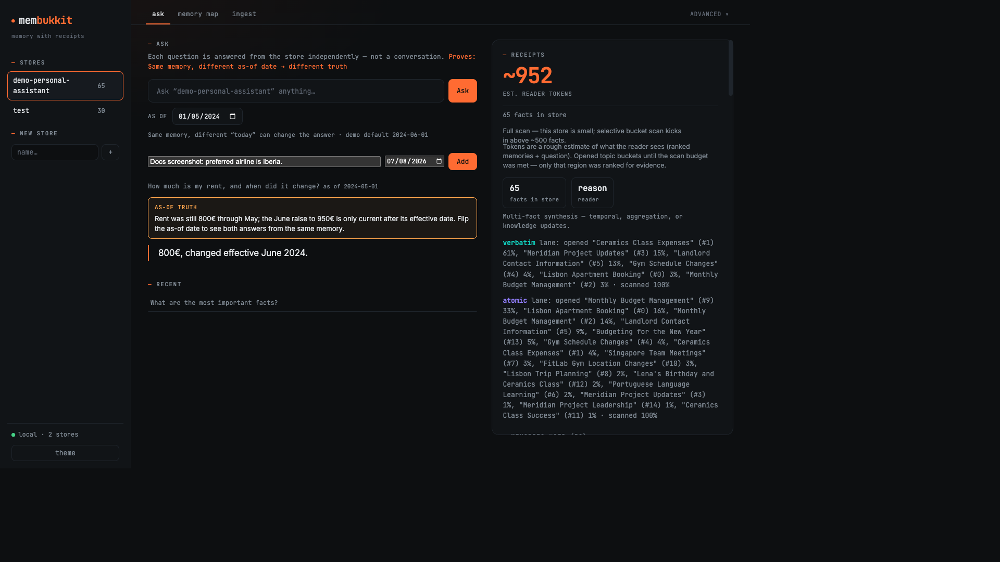

# Agents

Wire MemBukkit into an agent turn loop: **recall before you act**, **write a receipt after**, **ask as-of later**.



---

## Turn loop

| When | Call | Why |
|------|------|-----|
| Before a tool / decision | `search` or `ask` | Pull current (or as-of) truth into context |
| After a user turn or tool result | `add` | Persist durable lessons; inspect the **write receipt** |
| Later / different date | `ask(..., as_of=…)` | Same store, different horizon → different truth |

Empty LLM extracts never look like success: `add` returns `status` of `ok`, `empty_extract`, or `noop`, plus `n_stored` and `superseded`.

Bundled scene: `membukkit ui --demo agent-ops` (tool failure → fix → later recall).  
Script twin: [`examples/05_agent_loop.py`](https://github.com/memseekai/membukkit/blob/main/examples/05_agent_loop.py).

---

## Python (`Memory` facade)

```python
from membukkit import Memory

mem = Memory.from_pretrained(llm="openai:gpt-4o-mini")

# After a tool failure — write what happened
w = mem.add(
    "Tool deploy failed: kubectl timeout. Will retry with --request-timeout=60s.",
    subject="ops",
    date="2024-07-01",
)
print(w.status, w.n_stored, w.superseded)  # write receipt

w = mem.add(
    "Tool deploy_retry succeeded with --request-timeout=60s.",
    subject="ops",
    date="2024-07-01",
)

# Before the next deploy — recall
r = mem.ask("Last time deploy failed — what fallback worked?")
print(r.answer)
print(r.est_reader_tokens)
for e in r.evidence[:3]:
    print(e.status, e.source_ref, e.fact)
```

Power users: `MemorySystem.ingest` / `.answer` with prompt packs, see [Library API](library.md) and [Customization](customization.md).

---

## Local HTTP (same stores as the GUI) {#local-http}

With `membukkit ui` (or any process serving the local app) on port 8377:

```bash
# write a memory
curl -s http://127.0.0.1:8377/api/v1/notes/add \
  -H 'Content-Type: application/json' \
  -d '{"content":"Deploy fixed with --request-timeout=60s","date":"2024-07-01","subject":"ops"}'

# ask, as of a date
curl -s http://127.0.0.1:8377/api/v1/notes/ask \
  -H 'Content-Type: application/json' \
  -d '{"query":"What fallback worked for deploy?","as_of":"2024-07-15"}'

# retrieve evidence without a reader
curl -s http://127.0.0.1:8377/api/v1/notes/search \
  -H 'Content-Type: application/json' \
  -d '{"query":"kubectl timeout","as_of":"2024-07-15","top_k":5}'
```

Multi-tenant FastAPI service routes differ (`/v1/{owner}/…`), see [Memory service](service.md) and [HTTP API reference](../reference/http-api.md).

---

## MCP (Cursor / Claude Desktop)

Thin tools over the same disk stores: `memory_add`, `memory_search`, `memory_ask`
(requires the `mcp` extra, included in `all`):

```bash
membukkit mcp --store notes
```

Full Cursor config, example prompts, and failure notes: **[MCP](mcp.md)**.

---

## Write receipts

`add` / ingest return a receipt you should log in the agent trace:

| Field | Meaning |
|-------|---------|
| `status` | `ok` · `empty_extract` · `noop` |
| `n_stored` | Facts written this call |
| `superseded` | Prior facts marked superseded by this write |
| `warnings` | Non-fatal issues |

Ask receipts include `answer`, `evidence[]` (`status`, `source_ref`, …), and `est_reader_tokens`.

---

## Next

- [Documents](documents.md): file ingest + jump-to-source
- [Quickstart](quickstart.md): demos and CLI
- [Demos](demos.md): `agent-ops` and the rest
- [When to use](when-to-use.md): categories only
