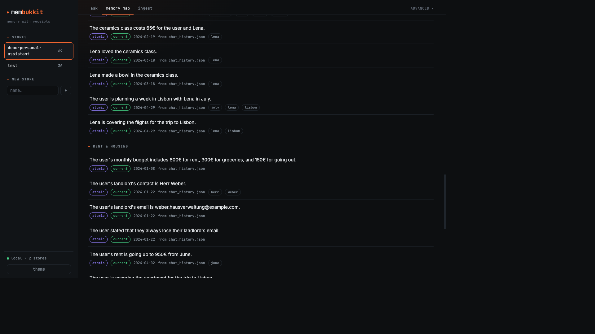
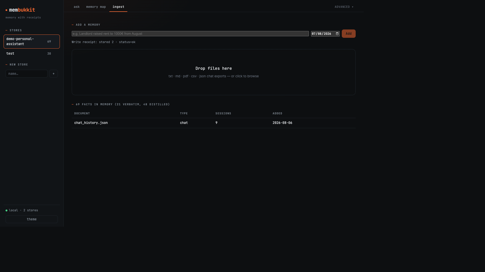

# Documents

Upload or ingest files, ask questions, and **jump to the source**, with as-of truth when clauses change.



---

## Contract demo

```bash
membukkit ui --demo contract-qa
```

Later amendments beat the original clause. In the GUI: **Ask** for the answer + evidence badges, **Memory → Truth** for current vs superseded facts on a timeline.

Also: `membukkit ui --demo personal-assistant` for chat-history as-of (May vs June rent). See [Demos](demos.md).

---

## Ingest

Supported by `membukkit ingest` today: **txt · md · pdf · csv · json / jsonl** (and folders of those).

```bash
membukkit ingest ./contracts --store legal
membukkit ask --store legal "What is the liability cap?" --as-of 2024-06-01 --show-trace
membukkit ui   # drag-and-drop onto an empty or existing store
```

Compose with your own parser: extract text (or structured turns) with **any document ETL**, then `add` / `ingest` into MemBukkit so dated facts, supersession, and receipts live in one place.

For product document Q&A with citations, stay on this page. Academic corpus RAG (EM/F1, passage index, no distillation) is a different mode. See **[RAG mode](../RAG.md)**.

---

## Citations & evidence

Ask responses include evidence items you can render next to a viewer:

| Field | Use in UI |
|-------|-----------|
| `source_ref` | Jump-to-source handle (turn / clause / doc ref) |
| `status` | `current` · `superseded` · `historical` |
| `fact` / `text` | Display line |
| `doc_name` | File or document label |
| `timestamp` | Fact date when known |

Write path: after ingest or live add, check `n_stored` and `superseded` so empty extracts never look like success. 

---

## React / fetch snippet

Local GUI server exposes the same stores. Example against `membukkit ui` on port 8377:

```ts
type Evidence = {
  fact: string;
  status: string;
  source_ref: string;
  doc_name?: string;
};

async function askStore(store: string, query: string, asOf?: string) {
  const res = await fetch(`http://127.0.0.1:8377/api/v1/${store}/ask`, {
    method: "POST",
    headers: { "Content-Type": "application/json" },
    body: JSON.stringify({ query, as_of: asOf }),
  });
  if (!res.ok) throw new Error(await res.text());
  const data = await res.json();
  return {
    answer: data.answer as string,
    evidence: (data.evidence ?? []) as Evidence[],
    estReaderTokens: data.est_reader_tokens as number | undefined,
  };
}

// Render answer + evidence list next to your PDF/markdown viewer.
const { answer, evidence } = await askStore(
  "legal",
  "What is the liability cap?",
  "2024-06-01",
);
```

Add path: `POST /api/v1/{store}/add` with `{ content, date?, subject? }`.  
Agent-oriented loop: [Agents](agents.md). MCP tools: [MCP](mcp.md).

---

## Next

- [Quickstart](quickstart.md)
- [Agents](agents.md)
- [When to use](when-to-use.md)
- [Customization](customization.md): e.g. `contracts` prompt pack
