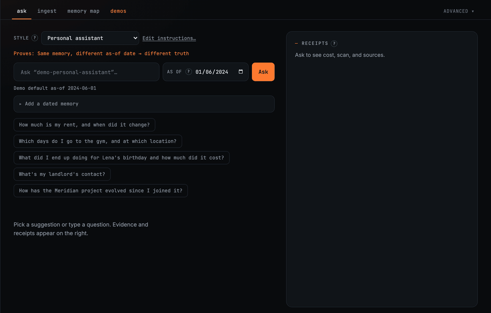
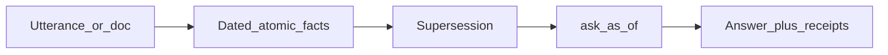

<p align="center">
  
</p>

# MemBukkit

**Long-term memory for LLM apps that shows its work.** Conversations and documents become
dated atomic facts. When something changes, the old fact is superseded rather than deleted,
so you can ask what was true on a date and get that date's answer, with receipts.



- **As-of truth.** Ask what was true on a date. Effective dates matter, not only when
  something was said.
- **Supersession.** An update marks the old fact superseded instead of silently deleting it,
  and you can [erase facts outright](guide/deleting.md) when you want them gone.
- **Receipts.** Evidence status, source refs, reader tokens, context percentage, and
  estimated cost, metered when the API reports usage.

```bash
membukkit ui                             # drop WhatsApp / ChatGPT ZIP / your PDFs
membukkit ui --demo personal-assistant   # no files? May vs June rent
```

## Mental model



Utterances and documents become **dated atomic facts**. Later updates **supersede** earlier
ones. `ask(as_of=…)` returns truth for that horizon, plus **receipts** you can inspect in the
GUI or the API.

Pipeline internals (distill, embed, bucket, budgeted retrieve, read) are in
**[Method](METHOD.md)**. Wondering whether you need this over file notes or plain vector RAG?
See **[When to use](guide/when-to-use.md)**.

## Start here

- **[Install](guide/install.md)**: uv, pip, or Docker, plus the extras table.
- **[Quickstart](guide/quickstart.md)**: demos, the CLI, and a Python snippet.
- **[Bring your own](guide/bring-your-own.md)**: WhatsApp, ChatGPT/Claude, CRM, project folders.
- **[Demos](guide/demos.md)**: bundled scenarios you can load with one command.
- **[Docker](guide/docker.md)**: `docker run`, volumes, environment variables, Compose.

## Build with it

- **[Agents](guide/agents.md)**: the turn loop, recall then act then write a receipt.
- **[Documents](guide/documents.md)**: ingest files and cite sources.
- **[MCP](guide/mcp.md)**: Cursor and Claude Desktop tools over the same stores.
- **[Library API](guide/library.md)**: `Memory`, `MemorySystem`, configuration, buckets.
- **[Deleting memories](guide/deleting.md)**: erase facts that are wrong or unwanted.
- **[Customization](guide/customization.md)**: prompt packs, instruction overlays, GUI editor.

## Going deeper

- **[Benchmarks](guide/benchmarks.md)**: reproduce every claimed score with `--repro`.
- **[Method](METHOD.md)**: the pipeline in detail.
- **[Storage backends](guide/storage.md)**: local stores, in-memory, and Turbopuffer.
- **[Memory service](guide/service.md)**: the multi-tenant FastAPI service.
- **[Troubleshooting](guide/troubleshooting.md)**: service gotchas and how to diagnose them.
- **[RAG mode](RAG.md)**: academic corpus retrieval with EM/F1 scoring.

## Repository layout

| Path | What it is |
|------|------------|
| `src/membukkit/` | The library: pipeline, models, retrieval, storage, CLI, service. |
| `ui/` | The React GUI. `membukkit ui` serves the prebuilt bundle. |
| `src/membukkit/demos/` | Bundled demo datasets, also linked as `demos/` at the repo root. |
| `notebooks/` | Quickstart, explainability tour, RAG mode, benchmarks. |
| `docs/` | This documentation site. |
